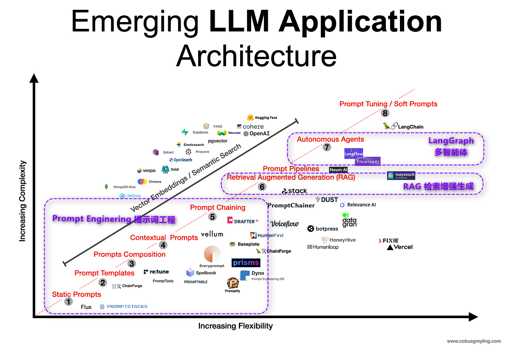

## 大语言模型（Large Language Model, LLM）

大语言模型（LLM）是一种基于深度学习的人工智能技术，它能够**处理和生成自然语言文本**。LLM 通过分析和学习大量的文本数据，理解语言的结构、含义以及语境，从而能够进行文本预测、回答问题、写作、翻译等任务。

## 大语言模型（Large Language Model, LLM）

### 能力

- **理解（Understanding）**：LLM 能够理解复杂的语句结构和隐含的意义。
- **生成（Generation）**：能够基于给定的上下文生成连贯、相关且通顺的文本。
- **推理（Reasoning）**：LLM 可以进行一定程度的逻辑推理，解答问题并提供解释。
- **学习（Learning）**：通过分析大量数据，LLM 能够学习新的信息和模式。

### 限制

- **理解深度（Depth of Understanding）**：尽管 LLM 在语言理解上非常先进，但它们仍可能缺乏对复杂概念和情境的深入理解。
- **常识和知识界限（Common Sense and Knowledge Boundaries）**：LLM 可能在常识判断和未包含在其训练数据中的知识领域上有局限性。
- **偏见和误解（Bias and Misinterpretation）**：由于训练数据的偏差，LLM 可能会生成带有偏见的内容或误解某些信息。
- **幻觉（Hallucination）**：LLM 有时会生成与事实不符的信息，即使没有明确的数据支持，也会“幻觉”出某些细节或事实。

### 如何对待 LLM？

- **LLM 是一个人**，请像对人类一样对待他（有智力，会犯错）
  - LLM 的天文、地理、物理、化学、**数学**……等等**知识都是语文老师教的**（文字关联性 > 本质关联性）
- **让 AI 替人干活，而不是让 AI 替人思考**
  - AI 将替代 task，而非替代 job —— 吴恩达
  - AI 要做的事情是让**会 AI 的人**替代不会 AI 的人
  - 我们将编写基于 LLM 的应用来**帮助人工作**，而不是替换掉这个人

### 学习本课程的核心收获：驾驭 LLM 所需的能力

- 认知（AI 管理者） ⭐⭐⭐⭐⭐
  - 拥有**广阔、深刻**的认知，不仅理解其技术原理和发展历程，而且能够**洞察未来趋势**，评估这些技术在不同领域的应用**潜力和影响**。能够从战略层面分析 AI 的**长期价值和挑战**，以及 LLM 在解决复杂问题中的**作用和限制**。
- 业务（AI 产品经理） ⭐⭐⭐
  - 对如何将 AI 和 LLM 技术应用到特定行业和业务流程中有清晰的**理解**和**规划**能力，能够**识别**并实现 AI **增值的机会**。
- 技术（AI 工程师） ⭐⭐
  - 模型：理解并使用相关的 AI 和 LLM 框架进行简单的数据处理、模型训练、模型部署。
  - 编程：能在 Copilot 等代码辅助工具的帮助下使用非擅长的编程语言（如 Python）进行**项目开发和问题调试**（⭐ 本课程主体内容）。
  - 运维：配置环境、排查故障，监控流量、评估系统性能等。
  - 更新：LLM 的技术更新极快，现在所用的东西在五年之后几乎都会过时 —— OpenAI CTO

### 常见问题

- **LLM 懂中文吗？**
  > LLM 是语言专家，理解人类的所有语言，甚至包括编程语言。可以要求 LLM 以特定的语种回答问题（⭐ 学习内容之一： Prompt Engineering 提示词工程 ）。
- **LLM 如何保证正确和安全？**
  > LLM 不保证答案正确。但通常会内置一些道德和伦理标准，以避免产生有害或不当的内容。也可以在用户的问题之外包裹一层，以约束问题和答案的内容、格式、语气等（⭐ 学习内容之一： Prompt Engineering 提示词工程）。
- **LLM 会被我们的对话过程训练吗？**
  > 不会。我们要“改变”LLM 的行为，就必须在每句对话都给出提示词（⭐ 学习内容之一： Prompt Engineering 提示词工程）。
- **LLM 有记忆吗？**
  > LLM 没有记忆。类似 ChatGpt 的“对话过程”都是有外部方法来存储数据的（⭐ 学习内容之一： Memory 记忆）。
- **LLM 知道所有事情吗？**
  > LLM 只知道（或概括性知道）他被训练时的事情。但他不知道之后的事情和现在发生的事情，这需要搜索引擎的帮助（⭐ 学习内容之一：Search Engine 搜索引擎）
- **LLM 可以访问我的数据/网络数据吗？**
  > 不行，但我们可以把我们的数据作为问题多一部分发送给他，这样他的答案就与我们的数据相关了（⭐ 学习内容之一：RAG 检索增强生成）
- **LLM 有自主意识吗？**
  > 没有，但是他可以分析问题，并自主选择工具来解决问题。（⭐ 学习内容之一：Agent-Langgraph 智能体）

## 大语言模型应用框架

**📝 大语言模型应用 = 一个专业应用 + 一个通用大语言模型**

> 例如：OpenAI 的 ChatGpt = 前端 web 应用（Chat） + 大语言模型（Gpt）

**📝Static Prompts（静态提示词）** 直接把静态问题扔进 LLM 接口。

> 例如：请给我讲一个关于猫的笑话。
> [课堂笔记：入门](#0101-hello-world) | [代码：101 Hello world.py](../code/lesson01_Get_Started/lesson0101_hello_world.py) | [代码：301 输入](../code/lesson03_Input_and_Output/lesson0301_input.py) | [代码：311 输出](../code/lesson03_Input_and_Output/lesson0311_pydantic_output.py)

**📝Prompt Templates (提示模板)**

> serve as predefined structures (**预定义的结构**) or formats (格式), aiding in the consistent (一致性) and efficient (效率) generation of these prompts, ensuring relevance (相关性) and clarity (清晰度) in interaction.

> 例如：“请用{language}（必须是某种人类语言）写一个关于{subject}的{item}（必须是短小的文学作品，比如诗歌、对联、笑话）。”
> [课堂笔记：提示词工程](#lesson02-prompt-engineering-提示词工程) | [代码：201 基本提示词](../code/lesson02_Prompt_Engineering/lesson0201_basic.py)

**📝Prompt Composition (提示词合成)**

> involves the process（**过程**） of creating (创建) and structuring (结构化) prompts to effectively communicate (有效沟通) with AI systems, requiring careful consideration of language (语言考量) and context (上下文) to elicit desired responses (期望的响应).

> 包括从 UI 控件、终端输入用户数据，从 **LangSmith 线上获取提示词片段**，组合生成最终的完整提示词。

**📝Contextual Prompts （情景提示词）** enhance 'context awareness' (**情境意识**), 'relevance' (相关性), 'interaction' (互动性), and 'adaptability' (适应性), forming a 'prompt chain' (提示链) for effective AI guidance.

> 例如：“你是一个手机套餐销售者，你只回答与套餐销售相关的问题。有如下的套餐及条件：……”

**📝Prompt chaining' (提示词链)**

> involves sequentially using 'prompts' (提示) to build upon previous responses（**对话历史**）, enhancing 'contextual understanding' (情境理解) and creating a coherent flow （有条理的流）in AI interactions, leading to more accurate and contextually relevant outcomes.

> 一个典型的 prompt chain 的例子就是 chatgpt，能创建 session 会话并持续交流同一个话题。

**📝Retrieval Augmented Generation' (检索增强生成)**

> integrates 'information retrieval' (信息检索) with content 'creation' (内容创作), boosting the 'precision' (精准度) and 'contextual relevance' (情境相关性) of the AI's output, thereby enhancing its 'performance' (性能).

> 要利用企业内部、用户个人的数据，就必然用到 RAG。比如：
>
> - 请用我电脑上的所有邮件和最近更新的文档，帮我写出这周的周报。
> - 请从给定的中考题库中，抽取若干题目形成模拟试卷。总分 {total_score} 分；其中选择题 {single_choice_score} 分……

**📝Autonomous Agents (自主智能体)**

> operate independently (**独立运作**), utilizing its autonomy to perceive its environment（自主感知环境）, make decisions (**做出决策**), and take actions (**采取行动**) to achieve specific goals, leveraging user-defined (用户定义) or autonomously acquired (自主习得的) tools（**工具**）through machine learning (机器学习) and adaptive algorithms (自适应算法)。

**📝Soft Prompts and Prompt Tuning (软提示词和提示词调优)**

> involve customization (**定制**) and refinement (精炼) of prompts to align with specific tasks or outcomes in language model (语言模型) interactions.

**LangChain and LangSmith**

> support this by providing tools and frameworks (工具和框架) that allow developers to implement(实现), fine-tune（优化）, store and use（存储并使用） prompts within the production environment（**生产环境**）. This process enables operators to experiment with and assess (评估) various prompt strategies, achieving optimal performance (最佳性能). Such functionality facilitates the dynamic creation (动态生成) of soft prompts, which can be precisely adjusted according to specific goals (特定目标), significantly boosting the efficiency (提高效率) of LLM applications.

## LangChain 框架

**LangChain** | **LangChain** is an **open source** **_framework_** for building applications based on large language models (**_LLMs_**). | Langchain 是一个**开源的** **_框架_**，用于基于大型语言模型（**_LLMs_**）构建应用程序。

### Modules 模块

**[LangChain Libraries (开发 SDK)](https://python.langchain.com/docs/integrations/components)**

> The Python and JavaScript libraries. | Python 和 JavaScript 库。

**[LangChain Integrations (第三方集成)](https://python.langchain.com/docs/integrations/providers/)**

> LangChain integrates with many providers. | 大量第三方集成。

**[LangServe（发布为 API）](https://python.langchain.com/docs/langserve)**

> A library for deploying LangChain chains as a EST API. | 一个将 LangChain 链部署为 REST API 的库。

**[LangGraph（智能体）](https://langchain-ai.github.io/langgraph/)**

> LangGraph is a library for building stateful, multi-actor applications with LLMs, used to create multi-agent workflows. | LangGraph 是一个用于构建具有**状态管理**的**多角色**应用程序的库，通过大语言模型 (LLMs) 实现，可用于创建**多智能体**的**工作流**。

**[LangSmith（DevOps 工具）](https://python.langchain.com/docs/langsmith/)**

> A developer platform that lets you debug, test, evaluate, and monitor chains built on any LLM framework and seamlessly integrates with LangChain. | 一个开发平台，允许您调试、测试、评估并监控基于任何 LLM 框架构建的链，并与 LangChain 无缝集成。

> **LangSmith** 暂时不开源且只支持云部署。可使用 **LangFuse** 代替。

# 概念辨析

## 大语言模型 LLM

大语言模型是基于深度学习技术，特别是自然语言处理（NLP）中的 Transformer 架构，通过海量文本数据训练得到的模型。它具有强大的语言理解和生成能力，能够处理多种语言任务，如文本生成、翻译、问答等。

- **概念**：侧重于模型本身的架构和训练，强调其技术层面与功能性。
- **例如**：GPT-3（生成式预训练 Transformer 模型）本身，它是一个强大的语言处理工具，具备生成文本的能力。

---

### 大语言模型应用 LLM Application

大语言模型应用是指将大语言模型技术应用于实际场景中的各种任务和服务，如聊天机器人、内容生成工具、智能客服等。它利用大语言模型的能力来实现特定目标，解决实际问题。

- **概念**在特定场景中，利用大语言模型的能力来解决实际问题或完成任务。

- **例如**：OpenAI 的 ChatGPT，它是基于 GPT-3 开发的聊天机器人，通过与用户互动提供各种服务。
