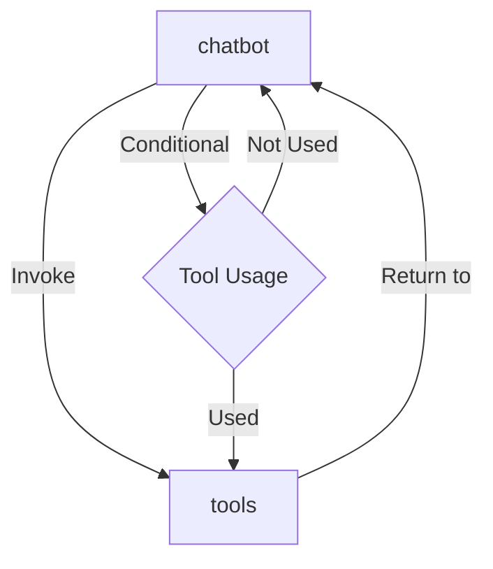
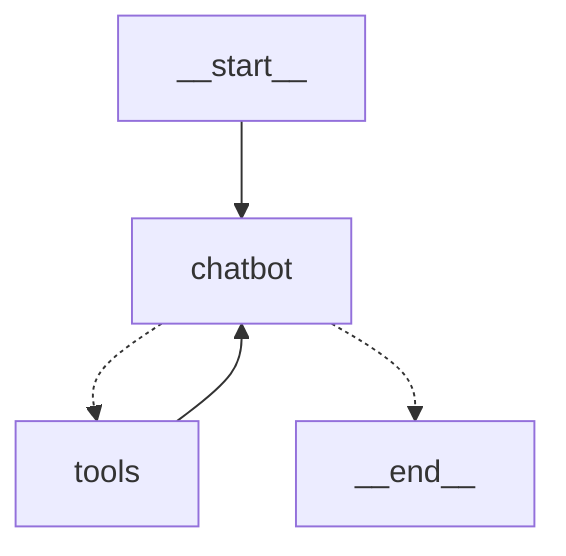
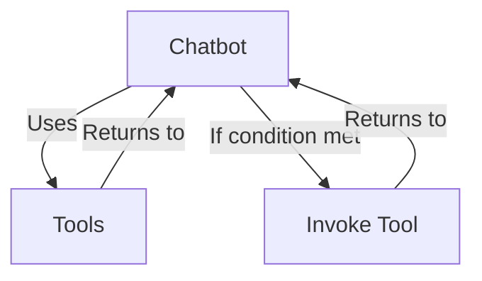
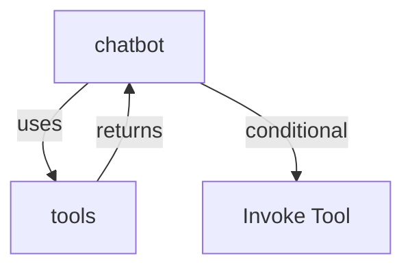
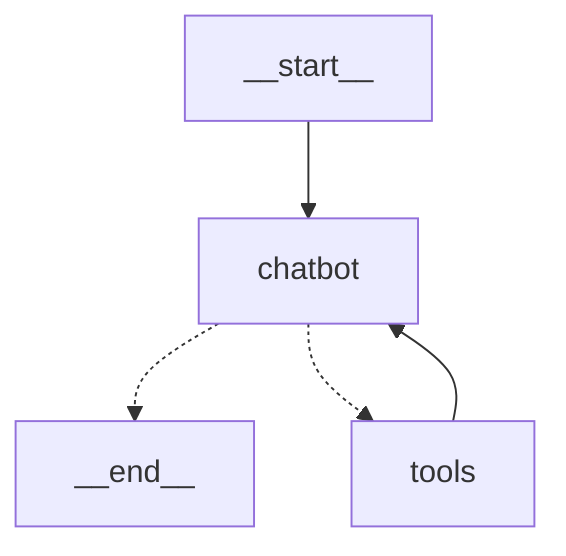

```mermaid
%%{ init : { "theme" : "default" } }%%
graph TD
    A[chatbot] -->|Invoke| B[tools]
    B -->|Return to| A
    A -->|Conditional| C{Tool Usage}
    C -->|Used| B
    C -->|Not Used| A
```

```mermaid
graph TD
    __start__ --> chatbot
    chatbot --> tools
    tools --> chatbot
    chatbot -.-> __end__
```

```mermaid
graph TD
    __start__ --> chatbot
    chatbot -.-> tools
    tools --> chatbot
    chatbot -.-> __end__
```

```mermaid
graph TD
    A[Chatbot] -->|Uses| B[Tools]
    B -->|Returns to| A
    A -->|If condition met| C[Invoke Tool]
    C -->|Returns to| A
```

```mermaid
graph TD
__start__ --> chatbot
chatbot --> tools
tools --> chatbot
chatbot -.-> __end__
```

```mermaid
graph TD
__start__ --> chatbot
chatbot -.-> tools
tools --> chatbot
chatbot -.-> __end__
```

```mermaid
%%{ init : { "theme" : "default" } }%%
graph TD
    A[chatbot] -->|uses| B[tools]
    B -->|returns| A
    A -->|conditional| C[Invoke Tool]
```

```mermaid
graph TD
__start__ --> chatbot
chatbot --> tools
tools --> chatbot
chatbot -.-> __end__
```

```mermaid
graph TD
__start__ --> chatbot
chatbot -.-> __end__
chatbot -.-> tools
tools --> chatbot
```
