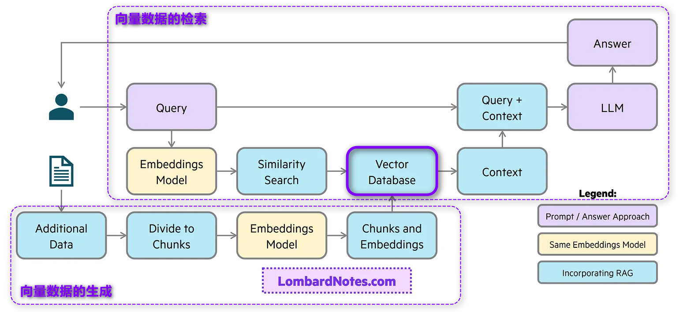

# 📖LLM RAG | 检索增强生成

## 什么是 LLM RAG？

RAG（Retrieval-Augmented Generation，即检索增强生成）是一种将大语言模型（LLM）与外部知识库结合的技术，用于提高回答的准确性和相关性。RAG 通过向量数据库存储和检索信息，在用户查询时从知识库中找到相关内容，并将其提供给 LLM，从而生成更高质量的回答。特别是在模型自身知识不足或数据过时的情况下，RAG 能显著提升回答的准确性。

RAG 的核心流程分为两部分：**向量数据的生成**和**向量数据的检索**。以下将结合图中的模块详细介绍 RAG 的工作原理。

### 向量数据的生成（Vector Data Generation）

向量数据的生成是 RAG 的知识基础，帮助构建高效检索的内容库。该过程包括数据收集、拆分、向量化和存储。

- **Additional Data** 首先，收集与应用场景相关的外部数据（如产品手册、FAQ、技术文档或学术论文），作为知识基础。所有这些内容将为检索提供信息来源。
- **Divide to Chunks** 为了提高检索的精准度，将数据拆分为更小的文本块（Chunks）。通常可以根据段落或句子进行拆分，确保每个文本块内容集中且不冗长，这样可以在检索时提高匹配的相关性。
- **Embeddings Model** 使用嵌入模型（Embeddings Model）将每一个文本块转化为向量表示。嵌入模型可以生成文本的特征向量，以便后续进行高效的相似度计算。图中的嵌入模型不仅用于文本块向量化，还用于用户查询的向量化，以确保二者可以在相似度空间中进行比对。
- **Chunks and Embeddings** 转换后的文本块和向量被组织成对，以便于存储和检索。这些嵌入后的文本块构成了 RAG 系统的知识库基础。可以理解为 Chunks 是信息，而 Embeddings 是其索引。
- **Vector Database**
  这些生成的向量数据存储在向量数据库中（如 Pinecone、Weaviate 或 FAISS）。向量数据库支持高效的相似度搜索，能够在用户查询时快速找到相关的上下文内容。

### 向量数据的检索（Vector Data Retrieval）

当用户提出问题时，RAG 系统会通过检索过程找到最相关的信息，并结合 LLM 生成回答。此过程包含以下模块：

1. **Query** 用户通过自然语言向系统提出问题，该问题作为 RAG 流程的输入，以便在向量数据库中检索到相关信息。
2. **Embeddings Model** 用户的查询会通过相同的嵌入模型转换为向量表示。这一步确保查询向量与知识库中的文本向量在相同的空间中，可以进行高效的相似度匹配。
3. **Similarity Search** 在向量数据库中进行相似度搜索，以查询向量为基础，查找最相关的文本块。这一步的目标是从数据库中筛选出与用户问题最相似的内容，构建上下文。
4. **Context** 检索到的相关文本块被整合为上下文（Context），用于丰富 LLM 的输入，确保其生成的回答能结合外部知识库中的信息。
5. **Query + Context** RAG 的核心步骤之一是将用户的原始查询和检索到的上下文信息结合起来，形成更完整的输入（Query + Context）。这样可以为 LLM 提供充分的信息源，使其生成的回答更加准确和相关。
6. **LLM** LLM 根据用户的查询和上下文内容生成回答。通过结合上下文信息，LLM 能够生成更符合用户预期且贴近实际需求的内容。
7. **Answer**
   最终，LLM 返回一个经过检索增强的回答（Answer），完成整个 RAG 流程。通过这种结合方式，RAG 系统可以显著提升回答的准确性和相关性。

### RAG 技术在 LLM 应用中的重要性（Importance of RAG in LLM Applications）

RAG 技术使得 LLM 能够从有限的内部数据扩展到实时获取的外部知识库，从而显著提升生成内容的准确性和相关性。通过外部向量数据库，RAG 可以实时提供最新的知识内容，广泛应用于问答系统、客户服务、教育等领域，为 LLM 的应用提供了更加广泛和灵活的可能性。
